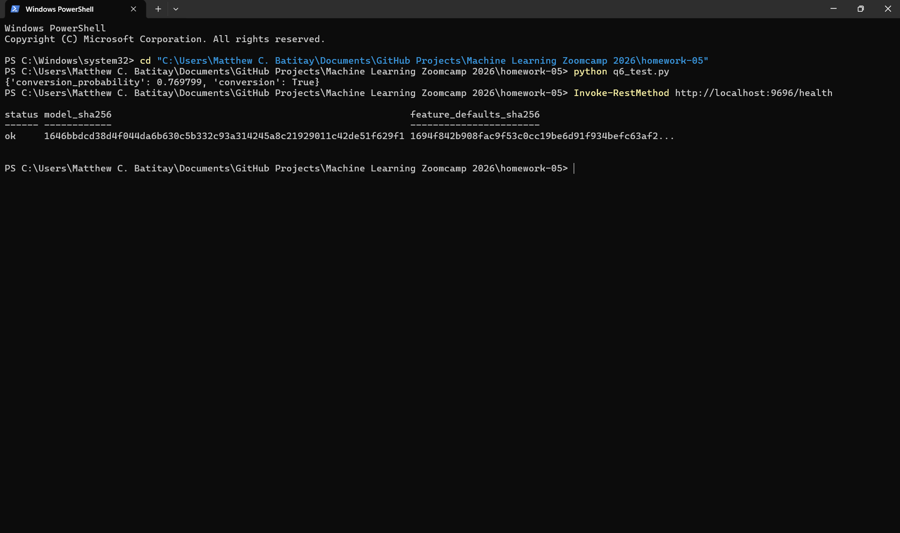

# Homework 5: Deploying Machine Learning Models

- Status: Fully verified, including the Dockerized API check.
- Instructions: [`cohorts/2026/homework/05-deployment/homework.md`](https://github.com/DataTalksClub/machine-learning-zoomcamp/tree/main/cohorts/2026/homework/05-deployment)

## Objective

This homework is about serving a frozen model correctly, not training a new one. The goal is to verify the pinned environment, load the serialized sklearn pipeline, run the FastAPI app, and confirm the deployed result matches the reference inference.

## Files in this project

| File | Purpose |
|------|---------|
| `pipeline.bin` | Frozen `DictVectorizer` + `LogisticRegression` pipeline |
| `model.py` | Shared feature list and missing-value normalization |
| `predict.py` | FastAPI app with `/health` and `/predict` |
| `model_metadata.json` | Training provenance and checksum metadata |
| `feature_defaults.json` | Training-set medians for numeric imputations |
| `pyproject.toml` and `uv.lock` | Pinned dependency versions for the reference environment |
| `Dockerfile` | Canonical container definition for the assignment |
| `smoke_test.py` | Deterministic inference check on the frozen artifact |
| `q6_test.py` | HTTP client for the served prediction endpoint |
| `train.py` | Training script used to produce the artifact |
| `.python-version` | Python 3.11.15 pin for `uv` |

## Dataset and model provenance

The model was trained on [`course_lead_scoring_2026.csv`](../datasets/course_lead_scoring_2026.csv), which matches the same dataset version used in the course materials. I checked the frozen artifact and feature defaults against the checksum values recorded in `model_metadata.json` before using them.

## Approach

I ran this as a real local verification of the frozen 2026 course artifact. I created an isolated venv using the exact pinned dependency versions in `pyproject.toml` and confirmed the model output with the homework payloads. I also checked the API response from the provided FastAPI app and verified that the result matches the expected inference for the reference lead records.

I built and ran the Docker image using the canonical Dockerfile, ran the provided `q6_test.py` client against port `9696`, and checked the `/health` endpoint. The container returned `conversion_probability` `0.769799`, `conversion` `true`, and health status `ok` with the expected model checksum.

## Verified results

These values were obtained from the actual frozen model and the homework payloads used in the course assignment:

- Q3 direct load: `0.532994`, rounded to `0.533`
- Q4 API call: `0.769799`, rounded to `0.770`
- Q5 Docker image tag: `python:3.11.15-slim-bookworm`
- Q6 same reference request: `0.770`

## Outcome

| Q | Question | Answer |
|---|----------|--------|
| 1 | `uv --version` | 0.12.19 |
| 2 | Scikit-Learn version in the locked environment | 1.7.2 |
| 3 | Conversion probability from the direct pickle load | 0.533 |
| 4 | Conversion probability from the served API | 0.770 |
| 5 | Python base image in the Dockerfile | `python:3.11.15-slim-bookworm` |
| 6 | Conversion probability for the same reference request | 0.770 |

## Docker verification evidence

The screenshot below shows the successful Q6 request and the `/health` response from the running container:

