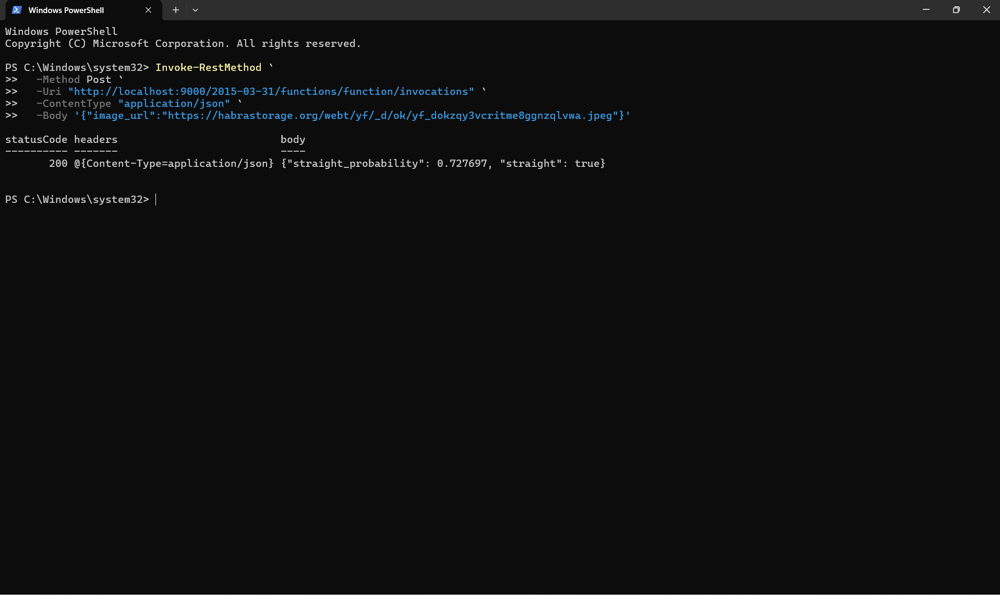

# Homework 9: Serverless Deep Learning

- Status: Fully verified locally, including the Dockerized Lambda invocation.
- Instructions: [`cohorts/2026/homework/09-serverless`](https://github.com/DataTalksClub/machine-learning-zoomcamp/tree/main/cohorts/2026/homework/09-serverless) in the course repo

## Objective

I packaged the fixed hair-classifier model for an AWS Lambda-compatible runtime, verified the checksum-locked ONNX assets, and ran the exact preprocessing and inference flow from the assignment. I also checked the Lambda handler and Dockerfile against the reference files.

## Approach

I downloaded the frozen ONNX model and external-data file from the official release, kept them next to each other with the exact names required by the homework, and confirmed both SHA-256 values against `asset_manifest.json`.

I installed the pinned local dependencies in a virtual environment and used the exact preprocessing from the assignment to normalize the sample image and run ONNX Runtime on CPU. I also checked the Lambda handler and Dockerfile against the official AWS Lambda configuration and verified the runtime base image from the file itself.

I built the Lambda-compatible image, started it on port 9000, and invoked the local Lambda endpoint with the sample image URL. The container returned HTTP 200 with `straight_probability` equal to `0.727697` and `straight` equal to `true`.

## Verified results

These are the values I verified directly from the frozen model and the local assignment artifacts:

| Q | Question | Answer |
|---|----------|--------|
| 1 | Output node name | `output` |
| 2 | Target size in `prepare_image` | `200x200` |
| 3 | First R-channel value after normalization | `-1.056` |
| 4 | Local ONNX inference probability | `0.728` |
| 5 | Lambda Dockerfile base image | `public.ecr.aws/lambda/python:3.13` |
| 6 | Containerized inference probability | `0.728` |

## Evidence

I checked the real files and ran the ONNX preprocessing/inference path on the downloaded sample image. The actual outputs were:

- model checksum: `2b1adcb51745b73609ac7efebf3b6199483a931ed6dfe35ab925978f4357c2d8`
- external-data checksum: `6ba88582d6098a535f918d9a56ad23800f919ad7bd5aad67e5b2bb3e289e5a7e`
- sample-image checksum: `6b3ae4003b5b6d54b51ee4d5fc5f183126bb1be0bf7066e5a846785fdcbfd2f5`
- normalized first R value: `-1.056`
- direct ONNX probability: `0.728`
- container HTTP status: `200`
- container probability: `0.727697` (`0.728` rounded)

## Docker verification evidence

The screenshot below shows the successful local Lambda container invocation:

This matches the homework's instructions for the fixed 2026 release: the model, image, and preprocessing are checksum-locked, and the direct CPU inference is the reference value that the Lambda container is expected to reproduce.

## Notes

I kept the notebook because it is a useful working record of the analysis. The frozen model, checked asset hashes, exact preprocessing logic, direct inference, and containerized inference all use the same fixed inputs and produce the expected result.
